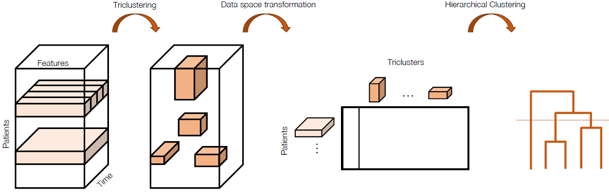

# ClusTric

Identifying disease progression patterns and groups of similar progressors is becoming relevant to the understanding of disease behaviours and to improving personalized treatments. Amyotrophic Lateral Sclerosis (ALS) is a neurodegenerative disease with patients manifesting heterogeneous temporal progressions. In this study we propose a novel approach, ClusTric, to learn comprehensive patterns from triclustering and use these patterns as features to obtain groups of patients with similar progressions. This is achieved from an agglomerative clustering process. We performed experiments using the Lisbon ALS clinic dataset containing data from patients' follow-ups. Our method presented relevant results regarding the flexibility of the analysis against the state-of-the-art. This methodology can be applied to the 3W data of any disease, obtaining similar results.



### Run Clustric:
```
python3 .\src\clustric.py <config_file>
```

#### Config File

```
DATA_FILE: <path_to_snapshots_file>
TOP_FOLDER: <output_folder_name>
N_CLUST: <number_of_clusters>  
MIN_APP: <minimal_number_of_appointments>             
REF_FEATURE: <feature_to_identify_each_patient>

TEMPORAL_FEATURES: <list_temporal_features>
```

### Relevant Citations
Full article can be found here: <insert article link>
